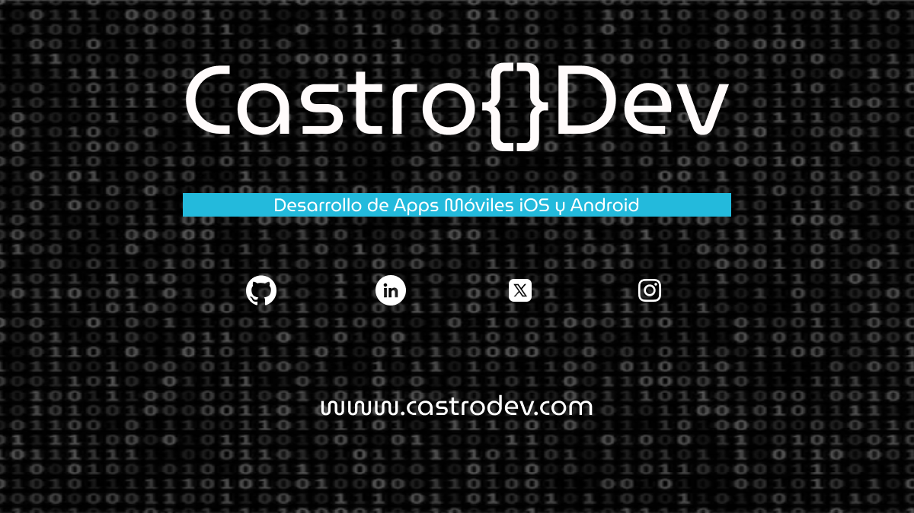

#  Hola, mi nombre es Gabriel Castro 👋🏻

### Mobile Developer

       
       
       &nbsp;
       &nbsp;
       &nbsp;
       &nbsp;
       &nbsp;
       &nbsp;
       &nbsp;
      &nbsp;
      &nbsp;
       &nbsp;
       &nbsp;
       &nbsp;
       &nbsp;
       &nbsp;
       &nbsp;
       &nbsp;
       &nbsp;
       &nbsp;
       &nbsp;
       &nbsp;
       &nbsp;
       &nbsp;
   

## 💼 Mis Proyectos
Aqui te dejo algunos de mis proyectos realizados hasta el momento:

 📑 [My CV](https://github.com/gcalvarez93/my-cv)
 
 ☀️ [Weather App](https://github.com/gcalvarez93/weather-ios-app)

 ➕ [Clon Calculadora iOS](https://github.com/gcalvarez93/calculadora-ios)

 Puedes consultar todos mis proyectos en: 

💼 [Mis Proyectos](https://github.com/gcalvarez93?tab=repositories)

## 🔎 Encuéntrame en

## ⚙️ &nbsp;GitHub Analytics

